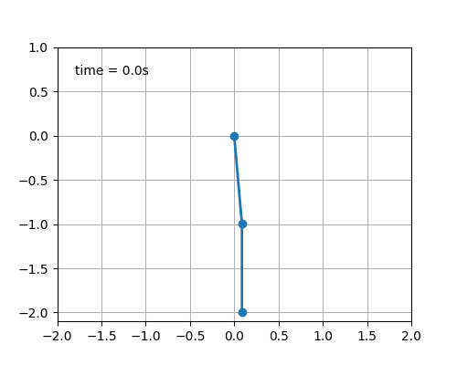

# Double Pendulum animation using `matplotlib.animation`

The equations of motion of a double pendulum are integrated by Runge Kutta methods
and the solution of the initial value problem is visualized in the phase plane.

Furthermore, an animation is created using `matplotlib.animation`. 

## Installation
### Ubuntu/Debian

```
sudo apt install python3-minimal python3-pip libpango1.0-dev pkg-config python3-dev libcairo2-dev
cd /some/folder/you/like/
# For https:
git clone https://github.com/antonia-kaufmann/double_pendulum_matplotlib.git
# For ssh:
git clone git@github.com:antonia-kaufmann/double_pendulum_matplotlib.git
cd double_pendulum_matplotlib
# if you want to use a virtual environment:
python -m venv venv
. venv/bin/activate
# to install requirements
pip3 install -r requirements.txt 
```

## Usage

```
python double_pendulum_main.py
```

## Example
### Double Pendulum


